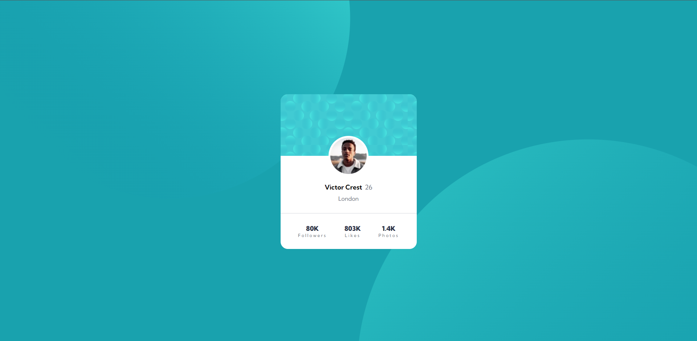

# Profile Card Component

This project is a responsive Profile Card Component created using HTML5 and CSS3. The challenge for this project is provided by Frontend Mentor.

## Table of Contents

- [Overview](#overview)
  - [Screenshot](#screenshot)
  - [Links](#links)
- [My Process](#my-process)
  - [Built With](#built-with)
  - [What I Learned](#what-i-learned)
- [Author](#author)
- [Acknowledgments](#acknowledgments)

## Overview

### Screenshot

### Links

- Solution URL: [GitHub Repository](https://github.com/Hard1stf/Profile-card-component)
- Live Site URL: [Live Demo](https://hard1stf.github.io/Profile-card-component/)

## My Process

### Built With

- Semantic HTML5 markup
- CSS custom properties
- Flexbox
- Mobile-first workflow

### What I Learned

Through this project, I gained experience in building a compact and responsive profile card component. Some key takeaways include:

- **Responsive Design**: Ensured the card is fully responsive and looks great on both mobile and desktop devices.
- **CSS Flexbox**: Utilized Flexbox to align and structure the card elements for a clean and flexible layout.
- **CSS Custom Properties**: Used CSS variables to manage color schemes and spacings, making the design easy to maintain and adjust.
- **HTML5 Semantics**: Improved the structure and accessibility of the component by applying semantic HTML.

## Author

- Frontend Mentor - [@Hard1stf](https://www.frontendmentor.io/profile/Hard1stf)
- GitHub - [@Hard1stf](https://github.com/Hard1stf)

## Acknowledgments

Thanks to Frontend Mentor for providing this project challenge and supporting continuous learning in frontend development.
